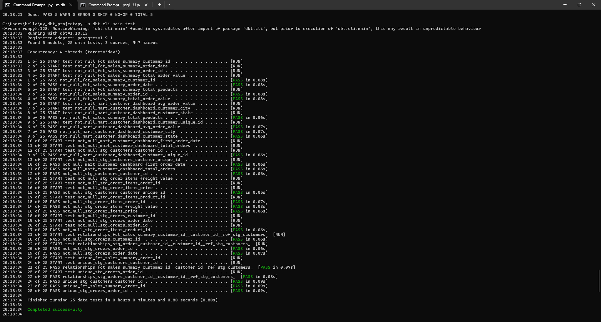
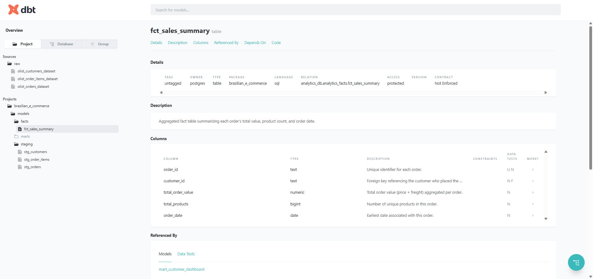
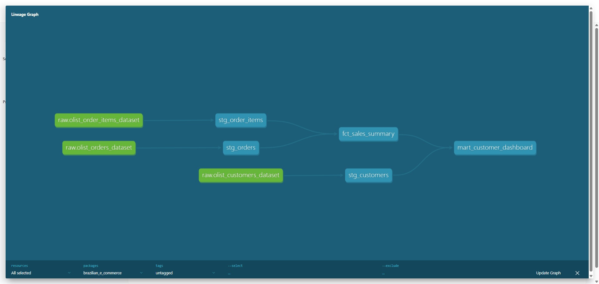

# dbt-analytics-pipeline
End-to-end data transformation project using dbt and PostgreSQL. Builds modern data warehouse layers (staging → facts → marts) with automated testing, documentation, and lineage tracking to transform raw datasets into analytics-ready insights.

### Project Overview

This project demonstrates how to design a modular data warehouse using dbt.
Starting from raw e-commerce tables (orders, customers, order_items), it creates three curated layers — staging, facts, and marts — that support analytics and dashboarding.

Each layer applies consistent naming conventions, schema testing, and data documentation, following modern ELT best practices.

### Key Highlights

| Feature                             | Description                                                      |
| ----------------------------------- | ---------------------------------------------------------------- |
|  **Automated Data Transformations** | SQL models compiled and materialized by dbt                      |
|  **Data Quality Testing**           | Built-in dbt tests for `unique`, `not_null`, and `relationships` |
|  **Layered Modeling**               | Clean separation between staging, facts, and marts               |
|  **Auto Documentation**             | dbt docs generate searchable model lineage                       |
|  **Lineage Tracking**               | Full data flow visualization via dbt docs lineage graph          |

### Data Warehouse Architecture
```
              ┌─────────────────────┐
              │     Raw Data        │
              │ (public schema)     │
              │  - orders.csv       │
              │  - customers.csv    │
              │  - order_items.csv  │
              └─────────┬───────────┘
                        │
                        ▼
        ┌───────────────────────────────────┐
        │           Staging Layer           │
        │  stg_orders, stg_customers, ...   │
        │  → clean columns, fix types       │
        └────────────────┬──────────────────┘
                         │
                         ▼
        ┌───────────────────────────────────┐
        │            Facts Layer            │
        │  fct_sales_summary                │
        │  → aggregates orders + items      │
        └────────────────┬──────────────────┘
                         │
                         ▼
        ┌───────────────────────────────────┐
        │            Marts Layer            │
        │  mart_customer_dashboard          │
        │  → analytics-ready KPIs           │
        └───────────────────────────────────┘
```

### Workflow

### Step 1. Define Data Sources
We start by declaring where our raw data lives. In this case, the PostgreSQL public schema. 
```
version: 2
sources:
  - name: raw
    schema: public
    tables:
      - name: olist_orders_dataset
      - name: olist_customers_dataset
      - name: olist_order_items_dataset
#code from sources.yml 
```
dbt doesn’t store data directly. Instead, it uses the source() function to reference existing raw tables in the database.
This ensures lineage tracking starts from the very origin of data.

Once defined, we can use {{ source('raw', 'olist_orders_dataset') }} inside models to reference these tables.

### Step 2. Build the Staging Layer
The staging layer cleans and standardizes raw tables. For example, converting timestamps and renaming columns for consistency.
Files on [stg_orders](models/staging/stg_orders.sql)
```
select
    order_id,
    customer_id,
    order_status,
    order_purchase_timestamp::date as order_date,
    order_approved_at::date as approved_date,
    order_delivered_customer_date::date as delivered_date
from {{ source('raw', 'olist_orders_dataset') }}
where order_status in ('delivered', 'shipped')
```
Besides, we use schema tests to ensure data quality (e.g. no null IDs, valid relationships)
Files on [stg_schema](models/staging/schema.yml)
```
models:
  - name: stg_orders
    description: "Cleaned and standardized orders data with essential timestamps and delivery status"
    columns:
      - name: order_id
        description: "Unique order identifier"
        tests:
          - not_null
          - unique

      - name: customer_id
        description: "Foreign key linking to stg_customers table"
        tests:
          - not_null
          - relationships:
              to: ref('stg_customers')
              field: customer_id
```

### Step 3. Create the Facts Layer
The facts layer aggregates business events, combining orders and items to calculate metrics like order value or product count.
Files on [fct_sales_summary](models/facts/fct_sales_summary.sql)
```
select
    o.order_id,
    o.customer_id,
    sum(i.price + i.freight_value) as total_order_value,
    count(distinct i.product_id) as total_products,
    min(o.order_date) as order_date
from {{ ref('stg_orders') }} o
join {{ ref('stg_order_items') }} i using (order_id)
group by 1, 2
```

### Step 4. Build the Marts Layer
The marts layer produces analytics-ready tables. For example, a customer dashboard aggregating key KPIs.
So we can use BI tools such as Tableau, Quicksight to analyze the mart dashboard directly.
Files on [mart_customer_dashboard](models/marts/mart_customer_dashboard.sql)
```
select
    c.customer_unique_id,
    c.customer_city,
    c.customer_state,
    count(distinct f.order_id) as total_orders,
    round(avg(f.total_order_value), 2) as avg_order_value,
    min(f.order_date) as first_order_date
from {{ ref('fct_sales_summary') }} f
join {{ ref('stg_customers') }} c using (customer_id)
group by 1, 2, 3
```

### Step 5. Run Data Tests
dbt automatically validates the models using built-in tests for nulls, uniqueness, and relationships. We can use cmd to run data test.
```
dbt test
```



### Step 6. Generate Documentation & Lineage Graph
Finally, generate the interactive documentation and lineage graph by using cmd
```
dbt docs generate
dbt docs serve
```

Then open the link (default: http://localhost:8080) to explore the model lineage




### Tech Stack
| Layer          | Technology     | Description                                |
| -------------- | -------------- | ------------------------------------------ |
| Transformation | **dbt**        | SQL-based transformation, testing, lineage |
| Database       | **PostgreSQL** | Data warehouse backend                     |
| Documentation  | **dbt docs**   | Auto-generated model & lineage docs        |
| Testing        | **dbt tests**  | Built-in and custom data quality checks    |


### Repository Structure

```
brazilian_e_commerce/
│
├── dbt_project.yml     
├── profiles.yml 
│
├── models/
│   ├── staging/
│   │   ├── stg_orders.sql
│   │   ├── stg_order_items.sql
│   │   ├── stg_customers.sql
│   │   └── schema.yml
│   │
│   ├── facts/
│   │   ├── fct_sales_summary.sql
│   │   └── schema.yml
│   │
│   └── marts/
│       ├── mart_customer_dashboard.sql
│       └── schema.yml
│
├── README.md                        
└── LICENSE                           


```
